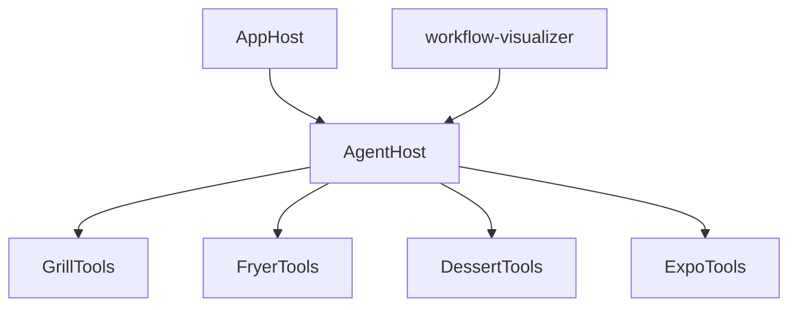
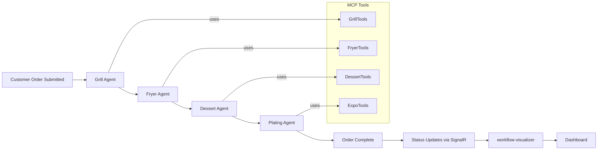
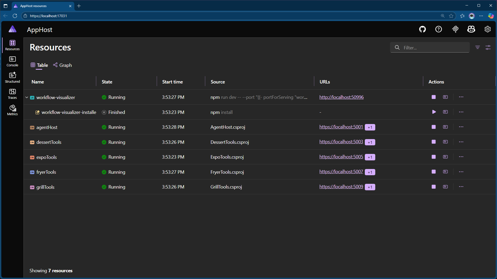
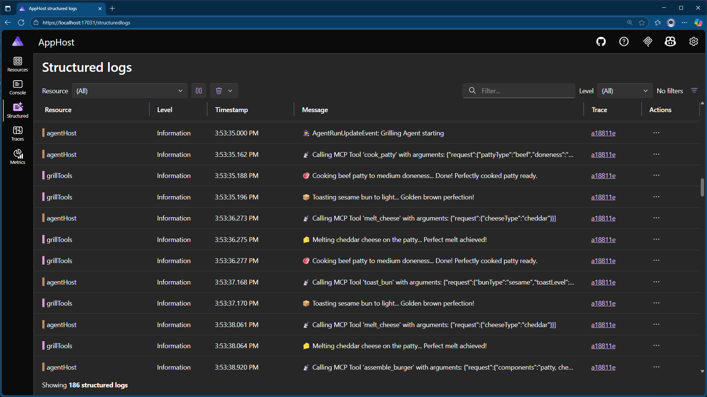
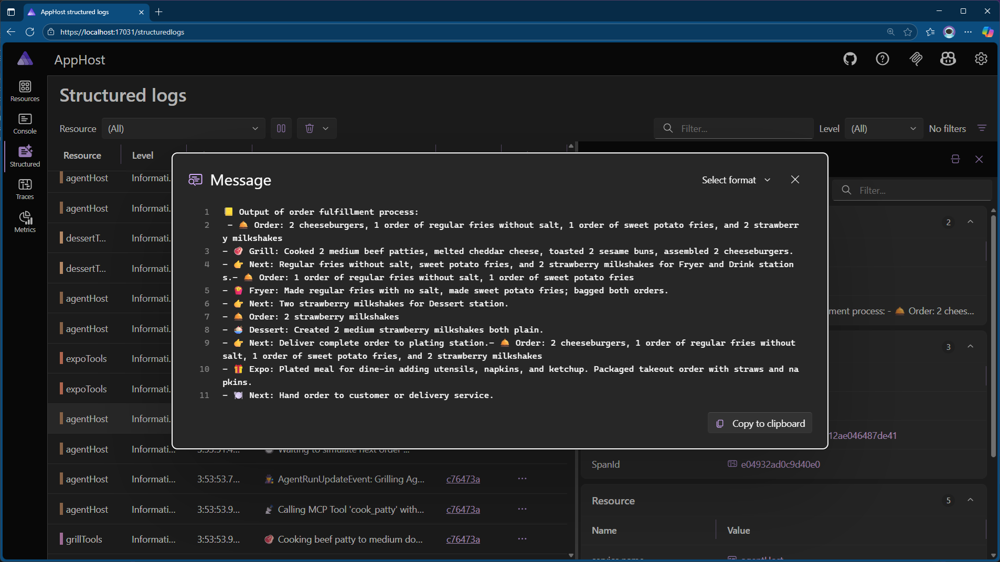
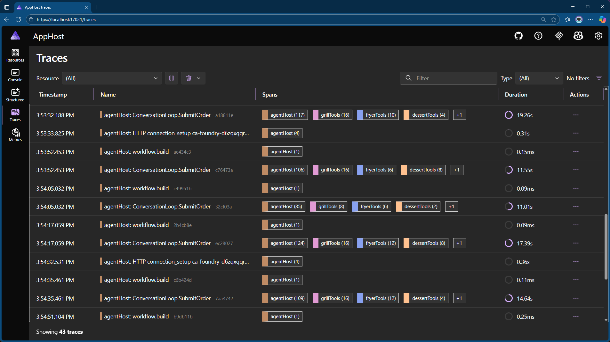
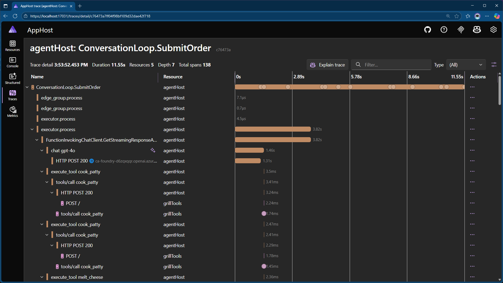
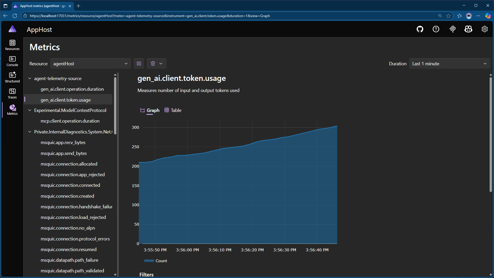
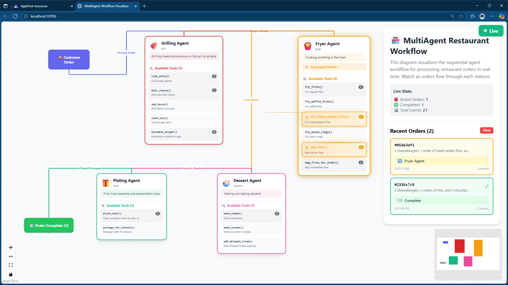

# MultiAgent Restaurant Workflow System

Welcome to MultiAgent! This solution demonstrates a modern, agent-based approach to restaurant order fulfillment, using Aspire, MCP (Model Context Protocol), and a suite of specialized microservices. The system is visualized with a React Flow dashboard, showing every step from order submission to completion.

---

## Solution Overview

MultiAgent is composed of several projects, each representing a distinct part of the restaurant workflow:

### AppHost
- **Purpose:** Orchestrates all services using Aspire.
- **Role:** Launches the agent host, tool servers, and the workflow visualizer. Handles service dependencies and startup order.

### AgentHost
- **Purpose:** Central hub for agent workflow and order status.
- **Role:** Implements the sequential workflow (Grill → Fryer → Dessert → Plating), manages agent metadata, and exposes a SignalR hub for real-time status updates.

### GrillTools, FryerTools, DessertTools, ExpoTools
- **Purpose:** Each is a dedicated MCP server hosting tools for a specific kitchen domain.
- **Role:**
  - **GrillTools:** Handles burger assembly, grilling, cheese melting, bacon, and buns.
  - **FryerTools:** Manages fries, onion rings, and all fried sides.
  - **DessertTools:** Makes milkshakes, sundaes, and adds whipped cream.
  - **ExpoTools:** Final plating and packaging for takeout/delivery.

### workflow-visualizer
- **Purpose:** React Flow app for visualizing the workflow and agent activity.
- **Role:** Shows the order journey, agent steps, and real-time status. Integrates with Aspire dashboard.


## How It Works

Below is a short overview of the workflow implemented by the agents built into this



---


## Visual Tour

Below are screenshots of the system in action, in the order they appear in the `docs` folder. Each image is accompanied by a brief summary:

### 1. Dashboard

The Aspire dashboard provides a high-level overview of the system's topology. Each of the `*Tools` projects running represent an individual collection of MCP tools used by a specific agent in their part of the workflow. 



### 2. Structured Logs

Structured logs display detailed, real-time event data from all agents and services, making it easy to trace actions and debug issues. 



### 3. Completed Order

Shows the final state of an order after it has been processed by all agents, including timestamps and completion details.



### 4. Traces

Visualizes the execution traces for each order, highlighting the sequence of agent actions and tool invocations. The `ConversationLoop.SubmitOrder` Activity represents the agents working together to satisfy an individual order. 



### 5. Submit Order

The Aspire dashboard's ability to view across compute nodes to see how a distributed task is resolved is helpful when building agentic and MCP-driven apps. 



### 6. Token Usage

Displays token usage statistics, useful for monitoring resource consumption and optimizing agent interactions.



### 7. Workflow In Action

Shows the workflow visualizer in action, with agents processing orders and updating the dashboard in real time.



---

## Project Details

### AgentHost
- **Implements:** SignalR hub (`/orderstatus`), workflow orchestration, agent metadata loading.
- **Tech:** ASP.NET Core, ServiceDefaults, custom DI extensions.

### AppHost
- **Implements:** Aspire orchestration, service wiring, dashboard integration.
- **Tech:** Aspire Hosting, Vite frontend integration.

### Tool Servers (GrillTools, FryerTools, DessertTools, ExpoTools)
- **Implements:** MCP server, tool registration, HTTP transport.
- **Tech:** ASP.NET Core, MCP, custom tool classes.

### workflow-visualizer
- **Implements:** React Flow visualization, real-time updates, agent metadata panels.
- **Tech:** React, React Flow, Vite, SignalR client.

---

## Extending the System

- **Add a new agent:** Create a markdown file in `AgentHost/Instructions/` and implement a new MCP tool server.
- **Change workflow:** Update the workflow definition in `AgentHost/Workflows/Orders/`.
- **Frontend updates:** The visualizer auto-loads agent and workflow metadata from the backend.

---

## Run with Aspire

   ```bash
   dotnet run --project MultiAgent.AppHost
   ```
   The dashboard and all services will start automatically.

---

## Technology Stack
- Aspire
- MCP (Model Context Protocol)
- ASP.NET Core
- React + React Flow + Vite
- SignalR

---

## Architecture Reference
- **Agents:** Defined in markdown, loaded by backend, exposed via API.
- **Workflow:** Sequential, but easily extensible to parallel/conditional.
- **Tools:** MCP servers, each with domain-specific tool classes.
- **Visualization:** Real-time, metadata-driven, extensible.

---

## License
MIT
